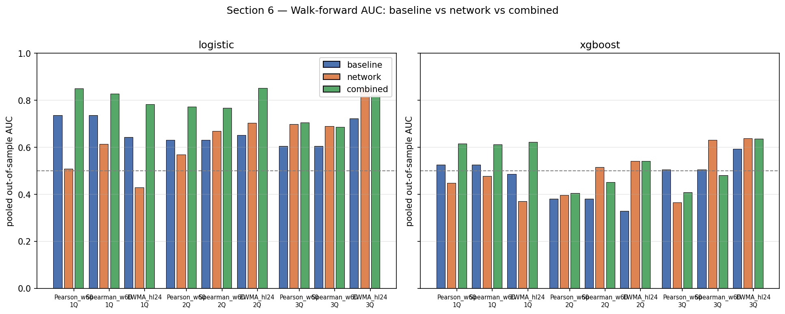
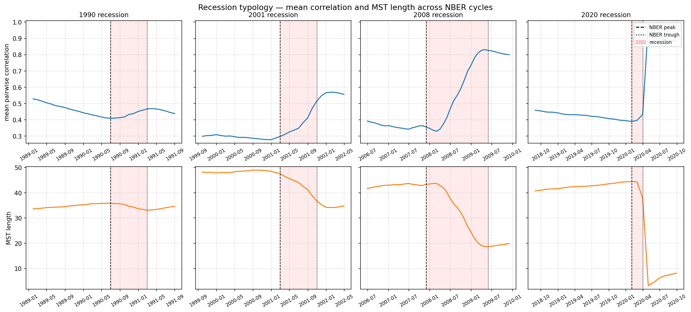

# State Co-Movement Networks for Recession Prediction

UCL COMP0047 — Data Science individual project. Builds a dynamic
correlation network over the 50 US states (Philadelphia Fed coincident
indexes, 1979–2025) and tests whether network features add predictive
power to a properly engineered macro recession baseline.

**Headline result.** Against the engineered 38-feature macro baseline,
network features add **nothing** at any horizon under either sparse-L1
logistic or tuned XGBoost; the 90 % paired-bootstrap CI brackets zero
everywhere. The descriptive recession typology shows *why*: the four
NBER events in the sample (1990, 2001, 2008–09, 2020) have
qualitatively different network signatures, so a single
fixed-coefficient predictor cannot fit them simultaneously.

The notebook
[`state_comovement_networks.ipynb`](./state_comovement_networks.ipynb)
assembles the full 10-section analysis (data → networks → features →
lead-lag → walk-forward → robustness → recession typology →
conclusion).

<!--
Optional: embed two key result figures so a reader who does not run
the notebook still sees the punchline. Uncomment after pushing.




-->

## Repository layout

```
state_recession/
├── state_comovement_networks.ipynb  — 10-section analysis notebook
├── data/
│   ├── raw/         — Phil-Fed Excel + FRED USREC
│   ├── processed/   — section-prefixed parquet/npz outputs
│   └── external/    — baseline data (macro economics engineered features) CSVs
├── src/             — data, networks, features, leadlag, modeling, plotting
├── scripts/         — section-prefixed runners (04, 06, 07, 08, 09)
├── experiments/
│   └── alt_feature_family/   — alternative network-feature (moments of the network) sensitivity check
├── figures/         — section-prefixed PNG outputs
└── reports/
    └── tables/      — section-prefixed CSV tables
```

## Pipeline → notebook section mapping

The notebook is organised into 10 sections; all processed data,
figures, tables, and scripts are prefixed with the matching section
number so files sort by pipeline order.

| Section | Topic | Key outputs |
| --- | --- | --- |
| 1 | Returns + sanity | `01_state_returns.parquet`, `figures/01_returns_sanity.png` |
| 2 | Stationarity | `reports/tables/02_stationarity_tests.csv`, `figures/02_acf_pacf.png` |
| 3 | Rolling correlations | `03_rolling_corr_*.npz`, `figures/03_mean_corr.png`, `figures/03_robustness_mean_corr.png` |
| 4 | Network features | `04_network_features_*.parquet`, `figures/04_network_features.png`, `figures/04_features_polished.png`, `figures/04_mst_snapshots.png` |
| 5 | Lead-lag | `05_leadlag_*.parquet`, `figures/05_leadlag_auc.png`, `figures/05_subsamples.png` |
| 6 | Walk-forward vs simple 6-feature macro baseline | `06_walkforward_simple.parquet`, `06_simple_*` robustness, `figures/06_auc_comparison.png`, `figures/06_bootstrap.png` |
| 7 | Walk-forward vs engineered 38-feature baseline (apples-to-apples) | `07_walkforward_engineered{,_xgb}.parquet`, `reports/tables/07_*.csv` |
| 8 | Statistical robustness (paired bootstrap, drop-COVID, C-sweep, alt-feature family) | `08_*.parquet`, `experiments/alt_feature_family/` |
| 9 | Recession typology + PMFG (descriptive) | `reports/tables/09_recession_typology.csv`, `figures/09_pmfg_*`, `figures/09_typology_*` |
| 10 | Conclusion | notebook section |

## Setup

```bash
# Python 3.11. Tested on macOS / Linux CPU.
python3.11 -m venv .venv
source .venv/bin/activate
pip install -r requirements.txt
```

If you do not have `xgboost` installed the engineered-baseline
XGBoost branch (Section 7) silently skips; the L1-logistic branch
still runs.

## Data

Two external sources, neither redistributed in this repository:

1. **Philadelphia Fed coincident indexes** (50 states, 1979–2025).
   Download the latest revised file from
   <https://www.philadelphiafed.org/surveys-and-data/regional-economic-analysis/state-coincident-indexes>
   and save it as `data/raw/coincident-revised.xls`.

2. **NBER recession indicator (USREC)** from FRED. Download
   <https://fred.stlouisfed.org/graph/fredgraph.csv?id=USREC> and save
   it as `data/raw/USREC.csv`. The notebook also caches a parquet
   copy at `data/raw/nber_usrec.parquet`.

3. **Project dataset baseline panel** — the `master_dataset_v20260317.csv`
   under `data/external/group_baseline/` contains the 6 
   macro signals (T10Y2Y, BAA10Y, UNRATE, INDPRO, CPIAUCSL, FEDFUNDS)
   and the recession targets used for the simple and engineered
   baselines. See the accompanying `PROVENANCE.md` in that folder.

## Reproducing the pipeline

Order matters. Each script reads inputs from the previous section
and writes its outputs into `data/processed/`, `figures/`, or
`reports/tables/`.

```bash
# Sections 1–5 are produced inside the notebook itself
# (state_comovement_networks.ipynb) or by helper modules under src/.

# Sections 6–9 have standalone runners:
python scripts/06_run_walkforward_simple.py
python scripts/06_run_simple_robustness.py
python scripts/07_run_engineered_walkforward.py    # sanity + logistic + xgboost
python scripts/08_run_robustness.py
python scripts/09_run_recession_typology.py        # MST fingerprint + PMFG snapshots

# Polished plots:
python scripts/04_plot_network_features.py
python scripts/06_plot_auc_comparison.py
```

Then open `state_comovement_networks.ipynb` to view the assembled
analysis.

## Methodological notes

- **Two baselines.** A simple 6-feature panel (untransformed levels of
  the six macro signals) for Section 6, and an engineered 38-feature
  panel (same six signals × {level + 3 lags + 2 rolling means} + 2
  post-break dummies) for Sections 7–8. The engineered set is the
  apples-to-apples comparator a network-feature claim must beat.
- **Walk-forward.** Pooled out-of-sample AUC, expanding window, refit
  every `step` quarters; train/test splits never overlap, no future
  information leaks into the predictor matrix.
- **Inference.** 90 % paired bootstrap on the difference in AUC
  (`baseline + network` minus `baseline alone`); CI brackets zero at
  every horizon.
- **Robustness.** Drop-COVID re-fits, regularisation `C`-sweep, and an
  alternative network-feature family under
  `experiments/alt_feature_family/` — none change the conclusion.
- **Descriptive evidence.** A recession typology built from MST
  fingerprints and PMFG centrality (Section 9) shows that the four
  NBER events in the sample have qualitatively distinct network
  signatures. This is the proposed mechanism for *why* a single
  fixed-coefficient model cannot extract a stable network signal.

## References

- Onnela, J.-P. *et al.* (2003). Dynamics of market correlations.
  *Physical Review E*.
- Tumminello, M. *et al.* (2005). A tool for filtering information in
  complex systems (PMFG). *PNAS*.
- Crone, S. & Clements, M. (2010). Recession-prediction methodology
  and walk-forward design.
- Philadelphia Fed coincident indexes:
  <https://www.philadelphiafed.org/surveys-and-data/regional-economic-analysis/state-coincident-indexes>
- NBER recession indicator (FRED USREC):
  <https://fred.stlouisfed.org/series/USREC>

## License

MIT — see [LICENSE](./LICENSE).
